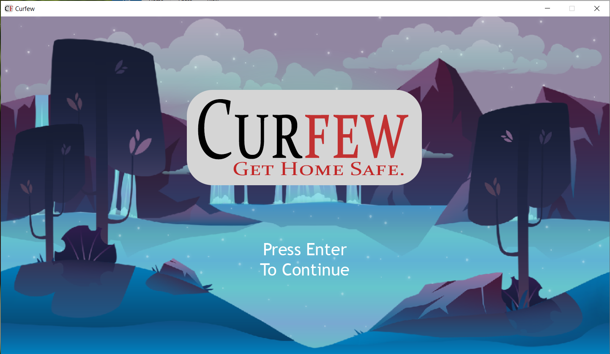
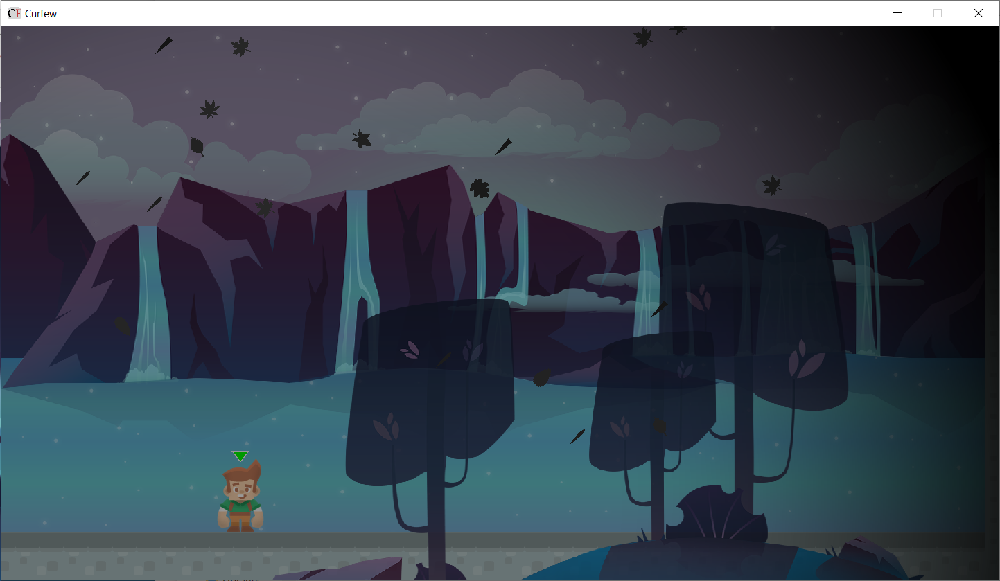
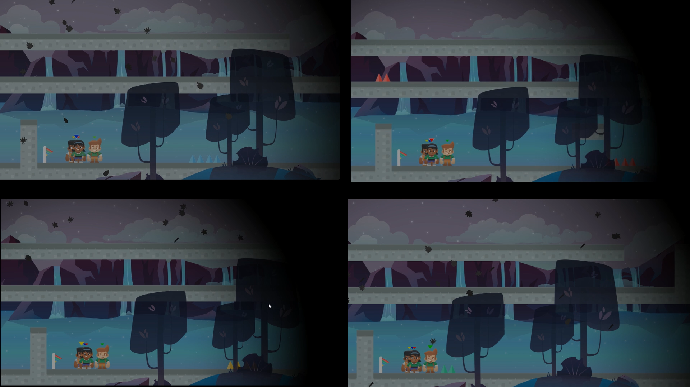
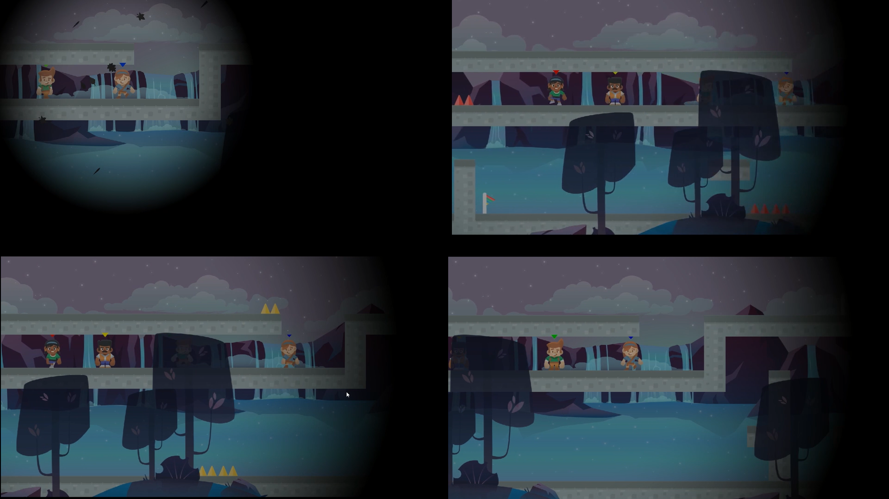

# Curfew: Multiplayer Game developed in Java

## Description
There are *dark* times ahead and there is only one way to escape it: Run! Which is easier said than
done when you can only see a small part of the world around you. But luckily you have friends who
can see what you cannot.

## Gameplay

## Running The Game
Simply run `sabrewulf-all.jar`.
